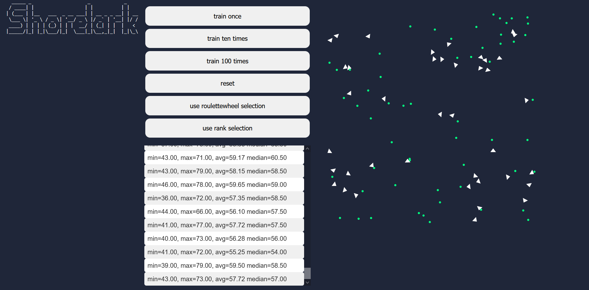

# shorelark-rust

simulation built with neural networks and genetic algorithms ( about birds :) ) implemented in Rust and compiled to WebAssembly.

to run:

```
1694209178207install wasm-pack
cd  libs/simulation-wasm
wasm-pack build --release
cd ../..
cd www
npm i
npm update
npm run start
```

it will run on localhost:8080


